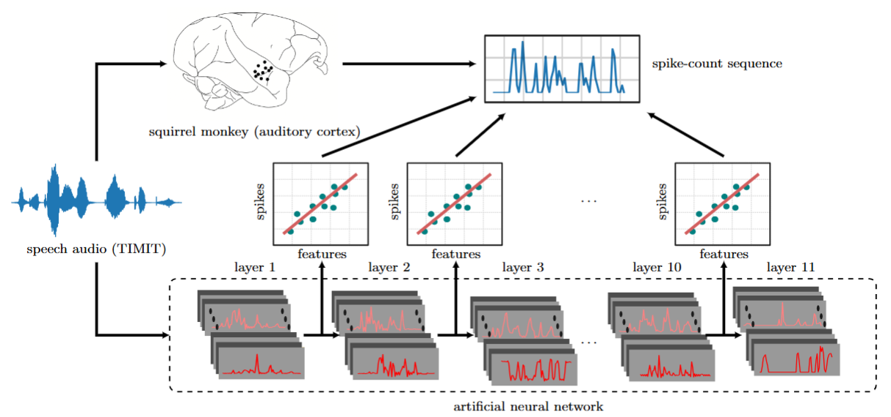

# Deep neural networks explain spiking activity in auditory cortex

> 📘 This is the **official implementation** for:  
> Bilal Ahmed et al., 2025
> [📄 Read the paper](https://www.biorxiv.org/content/10.1101/2024.11.12.623280v1)

## Overview
This repository provides the code used to model and analyze spiking activity in the auditory cortex using deep neural networks...



## 📂 Dataset

The neural dataset used in this project is publicly available on Zenodo:  
🔗 [Click here to access the dataset](https://doi.org/10.5281/zenodo.16175377)

> If you use this dataset, please make sure to cite it appropriately. See the [🔗 Citation](#-citation) section below.


## 📂 Repository Structure

The repository is organized as follows:

```
deep-auditory-spikes/
├── auditory_cortex/             ← Core project code
│   ├── dnn_feature_extractor/   ← Extracts features from pretrained DNNs
│   ├── neural_data/             ← Loads and preprocesses neural recordings
│   ├── plotters/                ← Plotting utilities
│   ├── analyses/                ← Analysis and evaluation scripts
│   ├── io_utils/                ← Handles caching, loading, and saving results
│   ├── config.yml               ← Configuration for datasets, models, paths, etc.
│   ├── dataloader.py            ← Loads DNN features and neural data
│   ├── data_assembler.py        ← Prepares training and testing data
│   ├── encoding.py              ← Fits temporal response functions (TRFs)
│   └── utils.py                 ← Miscellaneous utility functions
├── docs/                        ← Documentation and references
├── scripts/                     ← Experiment runner scripts
├── notebooks/                   ← Interactive Jupyter notebooks for analysis
└── README.md                    ← Project overview (this file)
```


## 🛠️ Installation

This repository depends on the following external GitHub repositories. Please make sure to clone and install them manually:

- https://github.com/bilalhsp/Wav2Letter  
- https://github.com/jgmakin/utils_jgm.git  
- https://github.com/SeanNaren/deepspeech.pytorch.git  
- https://github.com/mcdermottLab/pycochleagram.git  

You can install each of them using the following commands:

```bash
git clone <repo_url>
cd <repo_folder>
pip install -e .
```

Once the dependencies are installed, clone and install this repository:

```bash
git clone https://github.com/bilalhsp/deep-auditory-spikes.git
cd deep-auditory-spikes
pip install -e .
```

## ⚙️ Configuration

Before running any scripts or experiments, make sure to edit the `config.yml` file:

```bash
auditory_cortex/config.yml
```

This file defines key paths and parameters. You must update the following fields to point to your local environment:

```yaml
neural_data_dir: /path/to/neural_data/
pretrained_models_dir: /path/to/pretrained_models/
results_dir: /path/to/save/results/
cache_dir: /path/to/feature/cache/
```

> ⚠️ Make sure all the directories exist and are accessible before running the code.
> You can customize the provided file as needed.

## 🚀 Usage

The best way to get started is by exploring the example notebooks:

| Notebook | Description |
|----------|-------------|
| [`examples/1_neural_datasets.ipynb`](./examples/1_neural_datasets.ipynb) | Use neural dataset and metadata objects |
| [`examples/2_features_extractor.ipynb`](./examples/2_features_extractor.ipynb) | Use feature extractor objects to get DNN features |
| [`examples/3_dataloader.ipynb`](./examples/3_dataloader.ipynb) | Work with dataloader object (a unified interface to DNN features and neural data) |
| [`examples/4_data_assembler.ipynb`](./examples/4_data_assembler.ipynb) | Prepare training and test data |

> 💡 **Tip**: Make sure to first configure your environment using the `config.yml` file as described above.


## 📊 Plotting Correlation Results

Download the precomputed correlation results archive:

[📦 Download ahmed-25-corr-results.tar.gz](https://github.com/bilalhsp/deep-auditory-spikes/releases/download/v1.0/ahmed-25-corr-results.tar.gz)

Then extract it inside your results directory (make sure this matches the `results_dir` path in your `config.yml`):

```bash
cd /path/to/your/results_dir
tar -xzf /path/to/ahmed-25-corr-results.tar.gz
```

This will create the `ahmed-25` subdirectory with the correlation results.

Finally, run the plotting notebooks located in the `notebooks/` directory to generate the figures from these results.

## 🔗 Citation

If you use this codebase or build on the methods in this project, please cite the following paper:

> **Ahmed, B. et al. (2025).**  
> *Deep Neural Networks Explain Spiking Activity in Auditory Cortex.*  
> _PLOS Computational Biology_ (In press).


